# LUSTROUS — Documento Master

> **Plataforma web de ferramentas utilitárias para artistas**, focada em estudo de ilustração através de recursos visuais interativos.

---

## Quick Reference

| Ferramenta            | Propósito                                       | Tecnologia       |
| --------------------- | ----------------------------------------------- | ---------------- |
| **Perspective Grid**  | Grids de perspectiva configuráveis (1-3 pontos) | Canvas 2D        |
| **Visualizador .obj** | Visualização 3D de modelos                      | Three.js + WebGL |
| **Análise de Cores**  | Extração de paletas e análise teórica           | Canvas + K-Means |

---

## Arquitetura Geral

```mermaid
graph TD
    subgraph "Frontend (Next.js)"
        A[App Router] --> B[Layout Base]
        B --> C[Burger Menu]
        C --> D[Perspective Grid Tool]
        C --> E[OBJ Viewer Tool]
        C --> F[Color Analysis Tool]
    end

    subgraph "Cada Ferramenta"
        G[UI Controls] --> H[Tool Controller]
        H --> I[Domain Engine]
        I --> J[Renderer]
        J --> K[Export / Reset / Error]
    end

    D --> G
    E --> G
    F --> G

    style A fill:#1a1a2e
    style B fill:#1a1a2e
    style C fill:#1a1a2e
```

---

## Stack Técnica

| Camada           | Tecnologia                   |
| ---------------- | ---------------------------- |
| **Frontend**     | React + Next.js (App Router) |
| **Renderização** | Canvas 2D + Three.js         |
| **Backend**      | Node.js (serverless)         |
| **Banco**        | PostgreSQL                   |
| **Deploy**       | Vercel                       |
| **i18n**         | pt-BR, en, ja, zh-CN         |

---

## Documentação Relacionada

| Documento    | Descrição                   | Link                                                                                                                                              |
| ------------ | --------------------------- | ------------------------------------------------------------------------------------------------------------------------------------------------- |
| DVP          | Visão do Produto            | [DVP_Lustrous.md](file:///home/victor/programming/lustrous-workspace/lustrous/documentos/DVP_Lustrous.md)                                         |
| Requisitos   | RF/RNF completos            | [Requisitos_Lustrous.md](file:///home/victor/programming/lustrous-workspace/lustrous/documentos/Requisitos_Lustrous.md)                           |
| User Stories | Histórias de usuário        | [User_Stories_Lustrous.md](file:///home/victor/programming/lustrous-workspace/lustrous/documentos/User_Stories_Lustrous.md)                       |
| Arquitetura  | Arquitetura das ferramentas | [Arquitetura_Ferramentas_Lustrous.md](file:///home/victor/programming/lustrous-workspace/lustrous/documentos/Arquitetura_Ferramentas_Lustrous.md) |
| Algoritmos   | Algoritmos detalhados       | [Algoritmos_Lustrous.md](file:///home/victor/programming/lustrous-workspace/lustrous/documentos/Algoritmos_Lustrous.md)                           |
| Backlog      | Lista de tarefas            | [Backlog_Lustrous.md](file:///home/victor/programming/lustrous-workspace/lustrous/documentos/Backlog_Lustrous.md)                                 |
| Glossário    | Termos técnicos             | [Glossario_Lustrous.md](file:///home/victor/programming/lustrous-workspace/lustrous/documentos/Glossario_Lustrous.md)                             |
| Diretrizes   | Padrões de implementação    | [Diretrizes_Implementacao.md](file:///home/victor/programming/lustrous-workspace/lustrous/documentos/Diretrizes_Implementacao.md)                 |

---

## Princípios de Design

- **Client-side first**: Processamento no navegador para reduzir custos
- **Fullscreen tools**: Ferramentas ocupam 100% da viewport
- **Export ready**: Todas as ferramentas exportam em Full HD
- **Estética prismática**: Identidade visual inspirada em minerais e refração de luz

---

## Público-Alvo

- Artistas ilustradores
- Estudantes de arte
- Iniciantes em fundamentos de ilustração

---

## MVP — Ferramentas Principais

1. **Perspective Grid Tool**
   - 1, 2 ou 3 pontos de fuga
   - Terceiro ponto: acima ou abaixo do horizonte
   - Densidade configurável
   - Eye-level e rotação de horizonte

2. **Visualizador .obj**
   - Upload de modelos 3D
   - Modelos padrão fornecidos
   - Controles trackball + zoom
   - Reset para posição original

3. **Análise de Gama de Cores**
   - Upload de imagem
   - Extração de paleta por regiões
   - Interpretação teórica
   - Export em PDF
